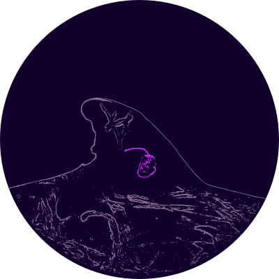
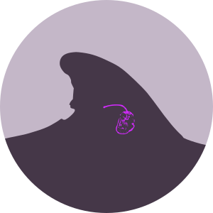

# zc_tag_sketches

license: 

## notes

- these are free to use within the bounds of the license above.

- some of the svgs without backgrounds will look bad if viewed on dark mode with the default dark outlines, but you can edit that.

- the teeth reads OK at presentation scale, but at figure scale they are a little small.

- need to add some coloration (pale head, oval patch) variation.

## references

1. Coomber F, Moulins A, Tepsich P, Rosso M. 2016 Sexing free-ranging adult Cuvier’s beaked whales (_Ziphius cavirostris_) using natural marking thresholds and pigmentation patterns. _Journal of Mammalogy_. 97(3):879-90. doi: [10.1093/jmammal/gyw033](https://doi.org/10.1093/jmammal/gyw033)

1. Coomber FG, Falcone EA, Keene EL, Cárdenas-Hinojosa G, Huerta-Patiño R, Rosso M. 2022. Multi-regional comparison of scarring and pigmentation patterns in Cuvier’s beaked whales. Mammalian Biology. 102(3):733-50. doi: [/10.1007/s42991-022-00226-6](https://doi.org/10.1007/s42991-022-00226-6)

### tags
dtag version 2

splash 10 tag

### whales

heavy scarring with teeth and background

heavy scarring with teeth and cookie cutter and background

light scarring with background

light scarring with cookie cutter and background

unadorned with background

### logos

